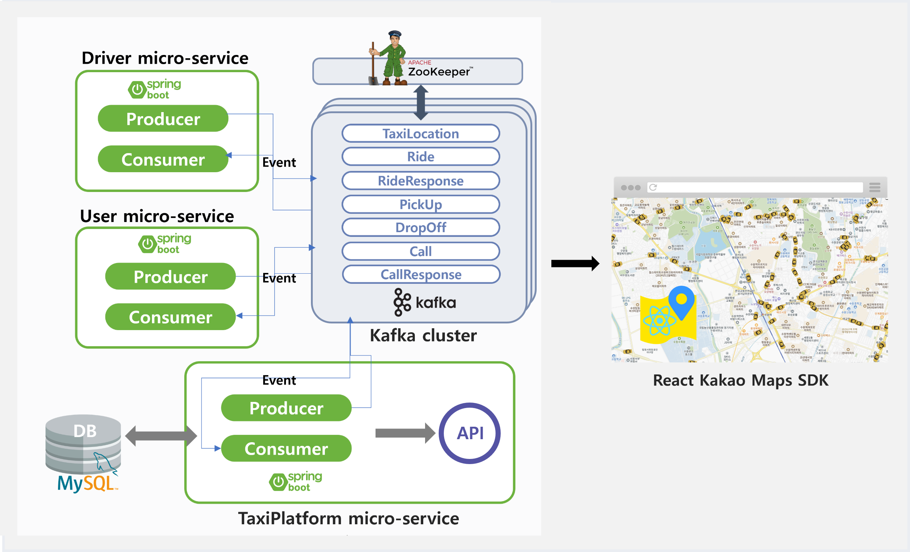
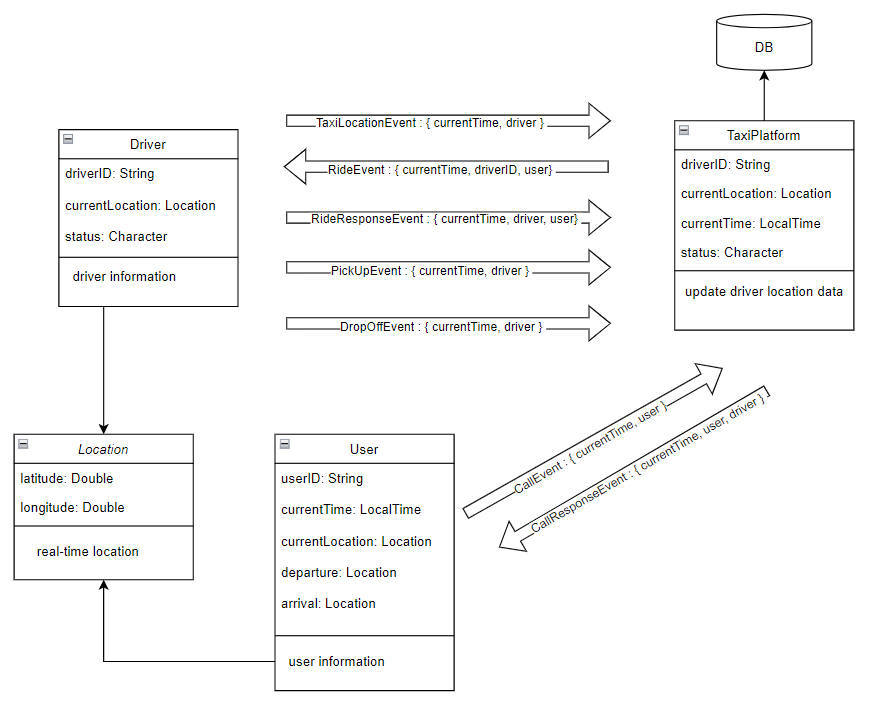

# Simulation of Virtual Taxi Service 🚕

This page contains only a general overview of the project and how to execute it. In Wiki, there are detailed descriptions of what each microservice is doing and what each event topic means.

## Event-Driven Microservices Architecture

You can see three microservices communicate with the Kafka cluster. They produce and consume events automatically.
All events are related to the taxi service.




## Getting Started
These microservices are decoupled, communicating with Kafka as an event broker. You'll need Kafka and Zookeeper installed on your computer.
```
kafka@v2.13-2.8.0. or higher
```

## Example of File Structure
```bash
- {Microservice}/ 
  - config/
    - KafkaTopicConfig.class
  - controller/
    - Controller.class
  - kafka/
    - Consumer.class
    - Producer.class
  - Controller.class
  - Application.class
```

## Event Topics
All microservices produce and consume events. In particular, driver microservice can generate events that periodically announce their location at specific times.


 
## How To Use
If you are ready, run Zookeeper and Kafka before running each microservices. The commands depend on the OS.

### 1. Run Zookeeper
```bash
# 1. Window OS
./bin/zookeeper-server-start.sh ./config/zookeeper.properties

# 2. Mac OS
./bin/zookeeper-server-start.sh ./config/zookeeper.properties
```

### 2. Run Kafka
```bash
# 1. Window OS
.\bin\windows\kafka-server-start.bat .\config\server.properties

# 2. Mac OS
./bin/kafka-server-start.sh ./config/server.properties
```

### 3. Run Microservice
From your command line, clone and run all microservices:
```bash
# Clone this repository
git clone https://github.com/lnalice/eda-taxi-back.git
```

## Utilization
You can modify the topic of the event and make some changes to its structure. Each microservice can communicate in another domain, not in the taxi domain.
